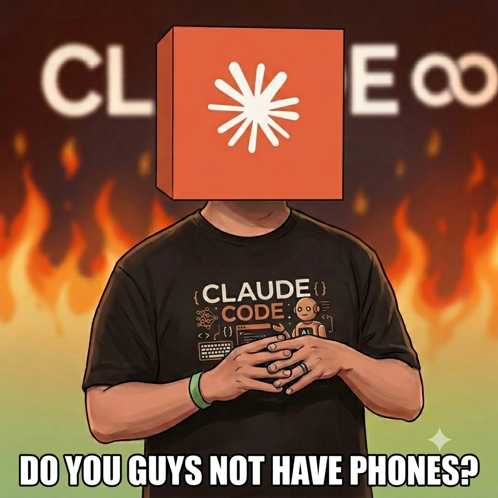

<h1 align="center">claude-remote-coding</h1>

<p align="center"><strong><em>DO YOU GUYS NOT HAVE PHONES?</em></strong></p>

<p align="center">
  
</p>

A [Claude Code](https://docs.claude.com/en/docs/claude-code) plugin that opens — and closes — background **Remote Control** sessions by voice or text, with no stolen window focus, so you can drive them from the Claude mobile app / claude.ai/code. Just tell your agent *"open a new session"* and a fresh, independent session spins up in the background (a minimized terminal on Windows, or a detached `tmux` session on Linux/WSL) and shows up in your mobile/web session list, ready to drive from your phone.

## Install (Claude Code plugin)

Add the marketplace first — on its own line. Don't paste an install line in the same message (it gets swallowed into this one as a bad repo argument and the clone fails).

```
/plugin marketplace add Zun-RZ/claude-remote-coding
```

### Install Two Plugins

Install either or both

- **`remote-tabs`** — open or close a background remote-control session by chatting in plain language (e.g. *"open a new session"*); start it on your PC and drive it from your phone (Claude mobile app).
  ```
  /plugin install remote-tabs@claude-remote-coding
  ```
- **`selection-is-all-you-need`** — It sends a notification to your phone at the end of every turn. Also, it will help with your decision.  
&emsp;If an explicit stop signal (종료, 그만, stop, exit, etc.) is given, it skips the AskUserQuestion.
  ```
  /plugin install selection-is-all-you-need@claude-remote-coding
  ```

No per-project setup — nothing is copied into your repo.

> Heads up: `selection-is-all-you-need` ships a forced output style, so it
> overrides any custom output style you've selected (your coding instructions
> are preserved via `keep-coding-instructions`). If two forced-style plugins
> are enabled, the first one loaded wins.

## Example use cases

**`remote-tabs`**

- From your phone, say *"open a new background session for this project"* and a detached session spins up (minimized terminal on Windows, `tmux` on Linux/WSL) that you pick up on claude.ai/code.
- Walk away from your desktop and keep long-running work (builds, refactors) going in the background, fully driven from the mobile app.
- End the session you're currently in with plain language — just say *"close this session."*
- Launch several tasks as independent sessions and switch between them like tabs on your phone.

**`selection-is-all-you-need`**

- Hand off a task from mobile and get the end-of-turn options delivered as a push, so you never miss when Claude needs you.
- During long-running work, get an actionable selection prompt instead of a silent text reply that leaves you unaware.
- Questions and options are generated in your own language and answered with a single tap on your phone.

## First open a session locally, then go mobile

You can't bootstrap from a cold start on your phone: opening a session needs a Claude Code agent already running to execute the command. So **start your first session on the desktop the normal way** (`claude`), then from that session ask it to *"open a new session"*. From then on every running session — including ones you opened remotely — can spawn more, so you can keep adding tabs straight from the mobile app.

## Usage

Just ask your agent, in any project:

> open a new session

(or *"open a new remote tab"*, *"open a session I can drive from my phone"*, …)

Claude picks the `open-remote-tab` skill automatically and starts a new background remote-control session. Each invocation starts a **new, independent** session, so multiple can run side by side for the same project.

- **Windows:** a **minimized** window (visible in the taskbar so you can close it manually).
- **Linux / WSL / macOS:** a **detached `tmux`** session named `claude-remote-<project>-<sec>-<pid>`.

The shell exits by itself when `claude` ends.

### Keystroke bridge: trigger `/clear` & co. from your phone

Built-in commands like `/clear`, `/compact`, `/model` are **client-side TUI
features** — the model can't run them and hooks can't fire them, so sending
`/clear` from the mobile app just arrives as plain text. remote-tabs sessions are
started inside a keystroke-injectable container with a background **inbox**
watcher, so appending a line to the inbox **types it into the real TUI** and the
built-in actually fires.

- From your phone, just tell the session to run **`bridge-send /clear`** — or the
  short alias **`bg.s /clear`** (easier to type on mobile) — a tiny helper that
  queues the line into the inbox so the bridge types it into the TUI.
  The model can't `/clear` itself, but `bridge-send` makes the bridge inject it.
  Works for `bridge-send /compact`, `bridge-send !git status`,
  `bridge-send "a plain prompt"` too; `/`/`!` lines get an ESC first to clear any
  open modal. (Under the hood: `bridge-send` appends to the inbox at
  `$CLAUDE_BRIDGE_INBOX`, printed on start as `inbox: …`; any external writer —
  SSH, a synced file — works the same way.)
- **Linux / WSL / macOS:** works out of the box (`tmux send-keys`).
- **Windows:** needs `pywinpty`. Without it the session still starts but injection
  is disabled (a note is printed). Enable it once — no system Python changes:
  ```
  powershell -File plugins/remote-tabs/scripts/setup-bridge.ps1
  ```
  (creates a managed venv at `%LOCALAPPDATA%\claude-remote-tabs\bridge-venv`; or
  set `REMOTE_TABS_PYTHON` to any python that has pywinpty.)

### Closing a session

Background sessions pile up. To clear the one you're in, just say:

> close this session

(or *"end this session"*, *"이 세션 종료"*, …)

Claude picks the `close-remote-tab` skill, asks for **one** confirmation (terminating drops the connection and no result comes back — on mobile it shows as a disconnect), and on `종료`/confirm ends the current session. It only ever closes the session you're in, never others.

**Skip the confirmation — `#@stop#@`:** send the exact keyword `#@stop#@` as the main content of a message and the session closes **immediately**, with no confirmation prompt. Use this when you're sure and don't want the extra tap, or when plain phrasing like "close this session" gets misread as just ending the current task. The keyword is deliberately odd so it won't fire by accident; it only triggers a fast close when it's the main thing you sent (not buried inside an unrelated message).

> Reliably ends sessions started with `open-remote-tab`; a plain `claude` in a terminal tab may restart after closing.

~~## Optional: no permission prompts (recommended once per project)~~

~~By default, the first `open-remote-tab` call in a project triggers a one-time permission prompt. To run without prompts (useful when driving from mobile), ask your agent once — ideally from the desktop:~~

> ~~set up remote tabs for this project~~

~~That runs the `setup-remote-tabs` skill, which merges `Bash(open-remote-tab*)` into the project's `.claude/settings.json` allow-list and sets `permissions.defaultMode` to `auto` (only if not already set). It's idempotent and never overrides existing values.~~
_Unnecessary_

## First run in a new folder: trust it

When you open a session in a folder Claude Code hasn't opened before, the new background session pauses on a one-time **"Do you trust the files in this folder?"** prompt. Approve it (from the mobile app / web) before the session can start working.

## Requirements

- [Claude Code](https://docs.claude.com/en/docs/claude-code) CLI (`claude` on your `PATH`)
- **Windows:** PowerShell 5.1 or 7+, plus Git Bash (bundled with Git for Windows — the plugin's entry point runs through the Bash tool). *Optional, for the keystroke bridge:* Python 3 + `pywinpty` (one-time `scripts/setup-bridge.ps1`).
- **Linux / WSL / macOS:** `tmux` (the keystroke bridge works out of the box via `tmux send-keys`)

## Note: these sessions are not saved locally

A remote-control session opened this way is **not** persisted to local storage — the conversation lives only on claude.ai/code (web), and the local file is an empty stub (so `claude --resume` won't reopen the transcript).

## Skills

| Skill | Purpose |
|---|---|
| `open-remote-tab` | Start one background remote-control session for the current project |
| `close-remote-tab` | End the current session (after one confirmation, or instantly with the `#@stop#@` keyword) — keeps zombie sessions from piling up |
| `setup-remote-tabs` | One-time opt-in: wire `.claude/settings.json` so sessions run without prompts |

## How it works

`bin/open-remote-tab`, `bin/close-remote-tab`, and `bin/bridge-send` are single POSIX entry points exposed on the Bash tool's `PATH`. Each detects the OS via `uname` (except `bridge-send`, which is OS-agnostic):

- **open — Windows** (Git Bash) → hands off to `scripts/open-remote-tab.ps1`. With `pywinpty` it launches `scripts/pty_host.py`, which owns a ConPTY around `claude --remote-control` and injects inbox lines (keystroke bridge); without it, it falls back to the original minimized PowerShell window (no injection). **Linux / macOS** → creates the detached `tmux` session and starts `scripts/bridge.sh` to inject inbox lines via `tmux send-keys`.
- **bridge-send** (alias **bg.s**) → appends its argument as one line to `$CLAUDE_BRIDGE_INBOX` (the session's inbox), so the bridge types it into the TUI. This is how `/clear` & co. are fired from a session.
- **close — Windows** → `scripts/close-remote-tab.ps1` walks up the process tree to the current `claude.exe`/`node.exe` and terminates it (the launcher window then closes on its own). **Linux / macOS** → kills the current `tmux` session, or walks up to the current `claude`/`node` process when not in `tmux`.

## License

MIT — see [LICENSE](LICENSE).
